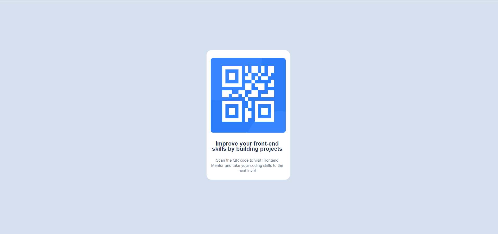

# Frontend Mentor | QR code component

Este é um desafio do [Frontend Mentor](https://www.frontendmentor.io), onde você pode melhorar suas habilidades em front-end construindo projetos reais.

## Visão geral

### O desafio

O desafio é construir um componente de código QR e torná-lo o mais próximo possível do design fornecido. Os usuários devem ser capazes de:

- Ver o layout ideal para o componente, dependendo do tamanho da tela do dispositivo
- Interagir com o componente (por exemplo, poder escanear o código QR)

### Screenshot

Adicione um screenshot do seu projeto aqui.

### Links

- URL do site: [Adicionar o link aqui](#)
- URL da solução: [Adicionar o link aqui](#)

### Construído com

- HTML5 semântico
- CSS customizado
- Flexbox
- Metodologia BEM

## Autor

- [@juliasier](https://github.com/juliasier)